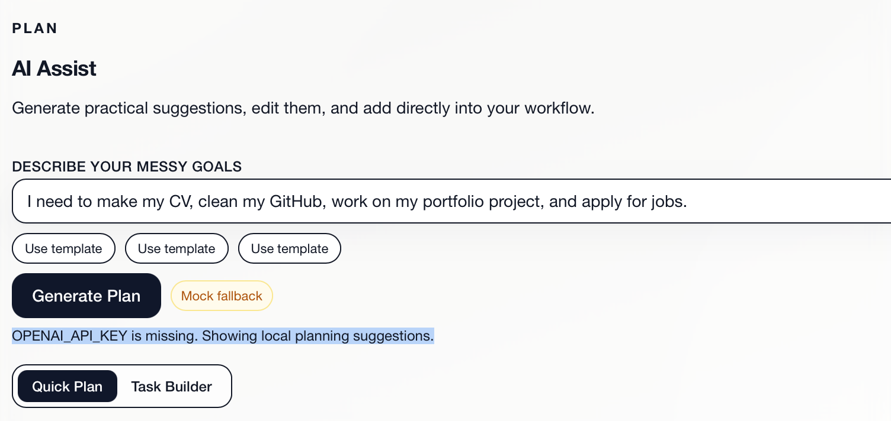

# Dayframe

Dayframe este o aplicație web modernă de productivitate, concepută ca un proiect solid pentru portofoliu.  
Scopul ei este să ajute utilizatorul să transforme idei și obiective haotice în planuri clare de acțiune, să lucreze concentrat și să își urmărească progresul în timp.

## Preview



## Prezentare generală

Dayframe a fost gândită ca o aplicație de productivitate cu un design calm, curat și premium, orientată pe utilizare practică.  
Aplicația combină managementul taskurilor, focus-ul zilnic, istoricul timpului lucrat și un modul de asistență AI pentru planificare.

Este potrivită pentru:
- organizarea taskurilor personale
- structurarea zilei de lucru
- lucru concentrat pe obiective importante
- demonstrarea unui produs web modern în portofoliu

## Funcționalități principale

### Workspace
- Adăugarea taskurilor cu:
  - titlu
  - notițe opționale
  - categorie / recurență: daily, weekly, monthly
  - prioritate
  - deadline
- Dacă deadline-ul nu este completat:
  - taskul este considerat automat `daily`
  - deadline-ul este setat implicit pe ziua curentă
- Afișarea taskurilor pe taburi:
  - daily
  - weekly
  - monthly
- Control complet asupra taskurilor:
  - start / pause timer
  - editare
  - marcare ca finalizat / nefinalizat
  - ștergere

### Focus
- Afișează taskurile începute în ziua curentă ca listă activă de focus
- Separă taskurile aflate în lucru de lista zilnică normală
- Fiecare task păstrează controalele complete:
  - start / pause
  - edit
  - done
  - delete
- Include statistici pentru ziua curentă:
  - progres
  - timp total de focus
  - numărul de timere active

### Daily History
- Păstrează istoricul activității începând cu prima zi reală de utilizare a aplicației
- Afișează vizual timpul lucrat pe fiecare zi
- Pentru fiecare task sunt afișate:
  - durata urmărită
  - bara relativă în raport cu totalul zilei
  - indicator de finalizare

### Assist (AI)
- Oferă sugestii prin endpoint-ul `POST /api/ai/suggestions`
- Folosește integrare reală cu OpenAI atunci când este disponibilă
- Revine automat la sugestii mock locale dacă API-ul nu este disponibil
- Include:
  - modul `Quick Plan`
  - modul `Task Builder`
  - indicator al sursei (`OpenAI` sau `Mock fallback`)
  - loading state
  - template-uri de prompt
  - deduplicare față de taskurile deja existente
  - adăugare individuală
  - adăugare în masă a taskurilor noi
  - posibilitatea de a edita categoria, prioritatea și deadline-ul înainte de adăugare

## Tehnologii utilizate

- **Framework:** Next.js (App Router)
- **Limbaj:** TypeScript
- **UI:** React + Tailwind CSS
- **State management:** local React state prin hook-uri custom
- **Persistență:** browser `localStorage`
- **AI:** integrare OpenAI cu fallback local mock

## Structura proiectului

```bash
app/           # rute, layout, API routes, global styles
components/    # componente UI și module funcționale
hooks/         # logică locală și management de stare
lib/           # utilitare, storage, timp, AI helpers
types/         # tipuri și modele de domeniu
